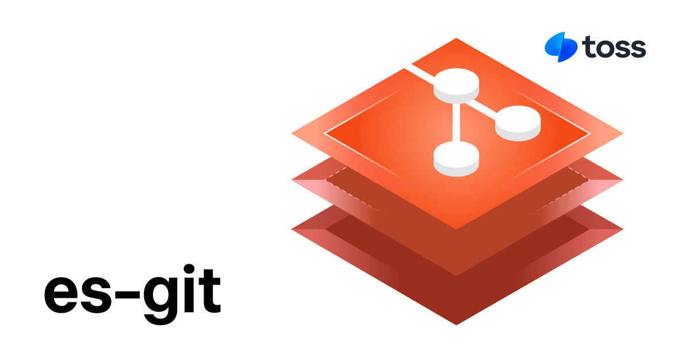

# es-git &middot; [](https://github.com/toss/es-git/blob/main/LICENSE) [](https://www.npmjs.com/package/es-git)

[English](https://github.com/toss/es-git/blob/main/README.md) | 한국어

es-git은 Node.js를 위한 현대적인 git 라이브러리예요. 간편하고 직관적인 인터페이스 덕분에 복잡한 git 작업도 쉽게 통합할 수 있으며, TypeScript 타입을 내장해 빠르고 안정적인 개발을
지원해요.

es-git은 libgit2를 바인딩한 [git2-rs](https://github.com/rust-lang/git2-rs)를 [napi-rs](https://napi.rs/)를 사용해 네이티브 모듈로 빌드하여,
운영체제와 상관없이 고성능 git 기능을 제공해요.

또한, node-gyp를 사용하지 않고 운영체제 및 cpu 아키텍처에 맞는 사전 빌드된 네이티브 모듈을 제공하기 때문에 사용자 환경에서 빌드하지 않고 간편하게
모듈을 설치할 수 있어요.

## 예제

```ts
import { cloneRepository } from 'es-git';

const repo = await cloneRepository('https://github.com/toss/es-git', '/path/to/clone');
const head = repo.head().name();
console.log(head); // "refs/heads/main"
```

## 문서

- [사용법](https://es-git.slash.page/ko/usage/repository.html)
- [레퍼런스](https://es-git.slash.page/ko/reference/Repository/openRepository.html)

## 기여하기

커뮤니티에 있는 모든 분들에게 기여를 환영해요. 아래에 작성되어 있는 기여 가이드를 확인하세요.

[CONTRIBUTING](https://github.com/toss/es-git/blob/main/.github/CONTRIBUTING.md)

## 라이센스

MIT © Viva Republica, Inc. 자세한 내용은 [LICENSE](./LICENSE)를 참고하세요.

<a title="Toss" href="https://toss.im">
  <picture>
    <source media="(prefers-color-scheme: dark)" srcset="https://static.toss.im/logos/png/4x/logo-toss-reverse.png">
    
  </picture>
</a>
